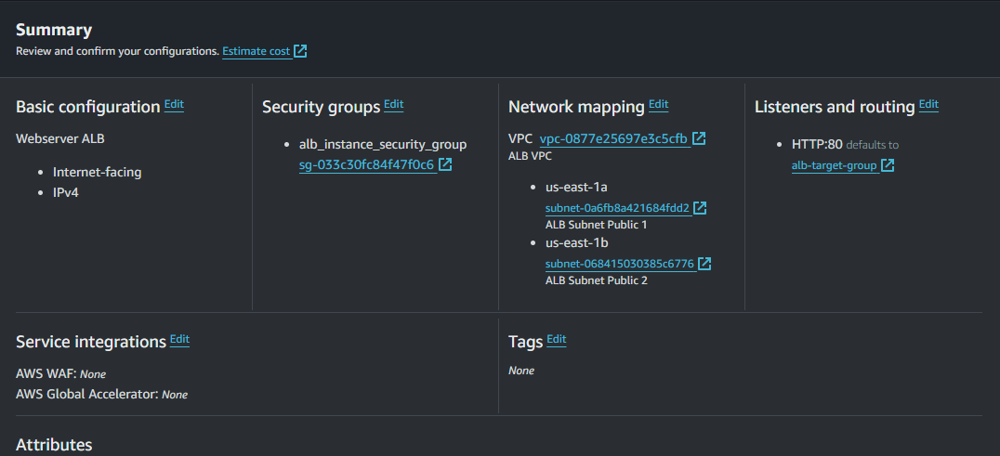
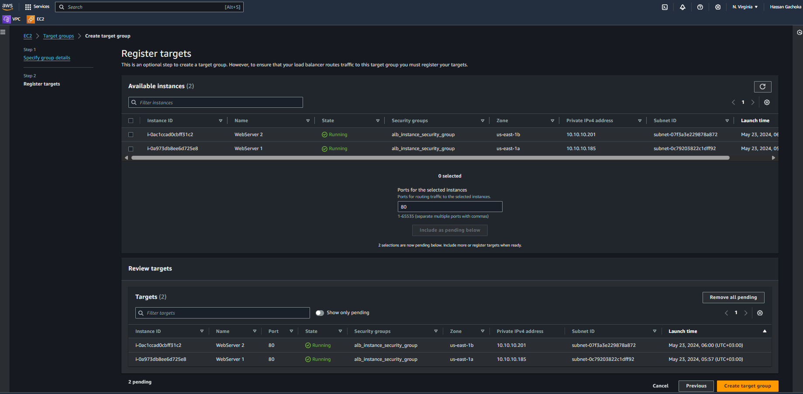

# Balancing Traffic with AWS Application Load Balancer (ALB) 🌐

---

## 📜 Table of Contents

1. [Project Overview](#project-overview)
2. [Architecture](#architecture)
3. [Features](#features)
4. [Key Deliverables](#key-deliverables)
5. [Challenges and Lessons Learned](#challenges-and-lessons-learned)
6. [Outcome](#outcome)
7. [Tools and Technologies Used](#tools-and-technologies-used)
8. [Steps to Reproduce](#steps-to-reproduce)
9. [Screenshots](#screenshots)
10. [Acknowledgments](#acknowledgments)
11. [Author](#author)

---

## Project Overview

This project focuses on setting up an **Application Load Balancer (ALB)** on AWS to balance traffic across multiple EC2 instances for a highly available and fault-tolerant application. The ALB ensures dynamic scalability, enhanced availability, and secure handling of application requests.

---

## Summary of the ALB

- **VPC**: A custom VPC with public and private subnets for high availability.  
- **ALB**: Distributes traffic across EC2 instances based on path and content-based routing.  
- **Target Groups**: EC2 instances are grouped for efficient traffic distribution.  
- **Security Groups**: Control inbound and outbound traffic for the ALB and EC2 instances.

---

## Features

- **Dynamic Load Balancing**: Automatically distributes incoming requests.  
- **Health Checks**: Monitors the health of targets to ensure requests are routed to healthy instances.  
- **Content-Based Routing**: Routes traffic based on request paths or host headers.  
- **TLS Termination**: Offloads SSL/TLS processing for better performance.

---

## Key Deliverables

1. **VPC Design**:
   - Created a VPC with multiple subnets for high availability.
   - Configured route tables for internet connectivity.

2. **EC2 Instances**:
   - Launched two instances with web servers.
   - Configured instance user data for web server setup.

3. **ALB Setup**:
   - Created an ALB with HTTP listeners.
   - Linked ALB to the target group for EC2 instances.

4. **Security and Monitoring**:
   - Configured security groups for the ALB and EC2 instances.
   - Enabled AWS CloudWatch for monitoring ALB metrics.

---

## Challenges and Lessons Learned

### Challenges
- Ensuring proper subnet association for the ALB.  
- Debugging health check failures caused by incorrect EC2 instance configurations.  

### Lessons Learned
- Health checks require consistent responses from instances to be marked healthy.  
- Proper IAM roles simplify ALB integration with other AWS services.

---

## Outcome

The project successfully demonstrated a **highly available and scalable application** using ALB. With path-based routing and health checks, the setup ensures seamless user experiences and aligns with cloud architecture best practices.

---

## Tools and Technologies Used

- **Amazon VPC**: Network infrastructure.  
- **Amazon EC2**: Compute resources for the application.  
- **Application Load Balancer (ALB)**: Traffic management.  
- **AWS CloudWatch**: Monitoring and logging.  

---

## Steps to Reproduce

1. **Create a VPC**:
   - Design subnets for public and private access.
   - Attach an Internet Gateway.

2. **Launch EC2 Instances**:
   - Deploy instances in private subnets.
   - Use a startup script for web server installation.

3. **Configure ALB**:
   - Create a target group and register EC2 instances.
   - Set up an ALB with HTTP listeners.

4. **Test the Setup**:
   - Access the application via the ALB DNS name.
   - Verify traffic balancing across targets.

---

## Screenshots

### ALB Target Group  

### Webpage from one of the web-server 

---

## Acknowledgments

Gratitude to the **AWS Documentation** and **NextWork Community** for the resources and support that guided the completion of this project.

---

## Author

**Hassan Gachoka**  
  

